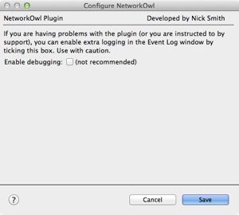
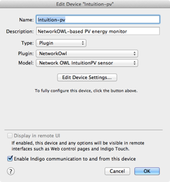
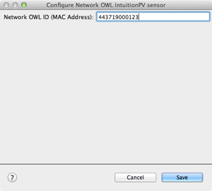

The [NetworkOWL](http://www.theowl.com/index.php/owl-intuition/) interfaces with a range of sensors from the OWL Intuition family. This plugin extends the [Indigo Domotics Indigo](http://www.indigodomo.com/index.html) Mac home automation application to support the NetworkOwl, the Intuition-pv &amp; lc electricity sensors and the Intuition home heating &amp; hot water sensors.

The [Intuition-pv](http://www.theowl.com/index.php/energy-monitors/solar-pv-monitoring/intuition-pv/) sensor provides real-time electricity consumption &amp; solar generation data to the NetworkOWL, which provides the data both to the OWL Intuition cloud application and as a multicast stream on the local network. The NetworkOwl Indigo plugin joins this multicast stream and updates Indigo device states based on the data received.

The Intuition-lc sensor is similar but provides data on 3-phase electricity usage, rather than solar PV generation.

## Installation

1) Download the [latest release](https://github.com/smudger4/NetworkOwl/releases) to the Mac running Indigo &amp; unzip it if necessary
2) Double-click on the NetworkOwl.indigoPlugin file: Indigo will ask if you would like to install it
3) The plugin’s configuration screen will pop up. Just hit Save to carry on.

## Configuration

1) From within the Indigo Devices list, click “New” and create a device representing the Intuition PV. Use the "Plugin" device type and then select "NetworkOwl" as the plugin. Finally, select the "Network OWL IntutionPV sensor" model.

2) The configuration screen will be displayed. Enter the MAC address of your NetworkOWL device. This can be found on the label on the back of the NetworkOWL device. Press "Save".

## Supported Operations

Interprets the following Intuition data packets:

* solar
* electricity
* weather
* hot water
* heating

Indigo V5 or later is required

## Release History

* v1.6 - 16 January 2016: Repackaged for release into Indigo Plugin Store. No functional changes to V1.5
* v1.5 - 22 April 2016: Updated Electricity packet to support a new version of the NetworkOwl product. Refactored code to make it easier to support future changes to the XML packet formats. Added support for Splunk-friendly logging &amp; also for different levels of logging
* v1.4 - 28 December 2015: Updated Heating &amp; Hot Water packets to support changes resulting from a firmware upgrade to the NetworkOwl product
* v1.3 - 27 December 2013: Updated to remove references to the Twisted framework as under OS X 10.9 (Mavericks) support for this has been removed in the (rather old) version of Python used by Indigo
* v1.2 - 17 June 2013: Updated to support read-only use of heating &amp; hot water sensors
* v1.1 - 9 April 2013: Updated to support Intuition-lc
* 1.0 - 24 November 2012: Initial release

[Back to Index](https://smudger4.github.io)